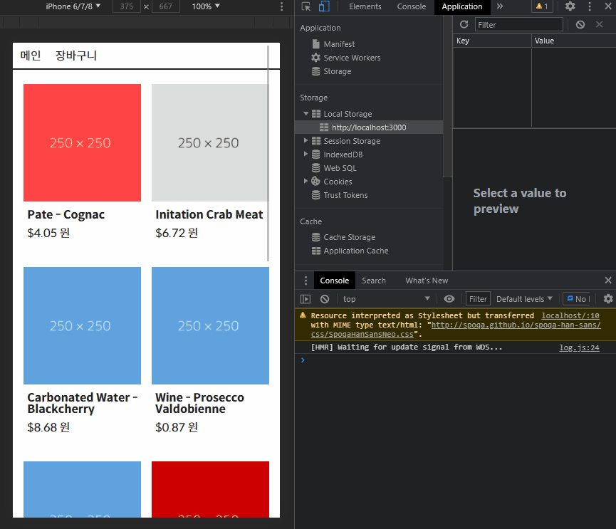

# simple react shopping mall

## goal

- 이 프로젝트의 목적은 실제 Shoppping Mall을 만드는 것이 아닙니다.
- 간단한 기능을 실제로 구현해보면서 Navigation, Router, state, props 등의 React 기본적인 기능에 대해 이해하는 것을 목표로 합니다.
- 실제 프로젝트에서는 React와 함께 Redux 등 상태관리 도구를 같이 사용하지만 이 프로젝트에서는 사용하지 않고 React의 기본 흐름을 이해하는 데 집중합니다.

## stack

- NPM
- Yarn

## Preview

